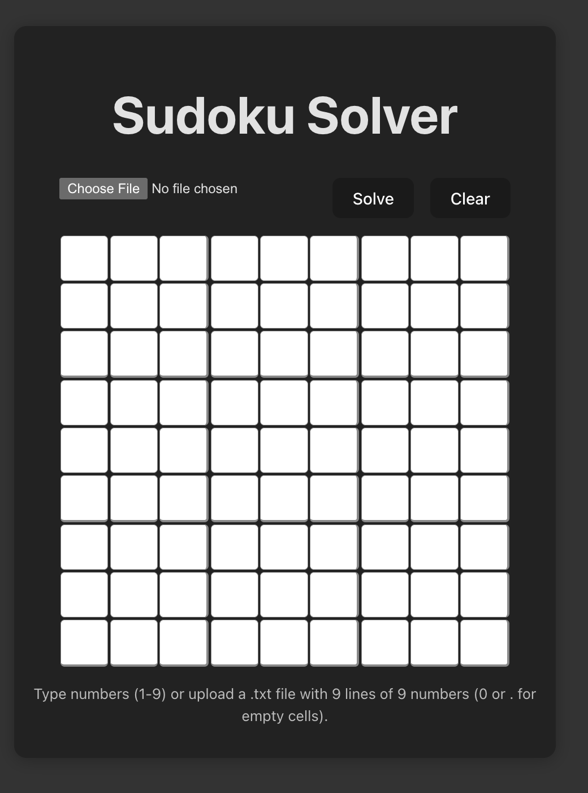
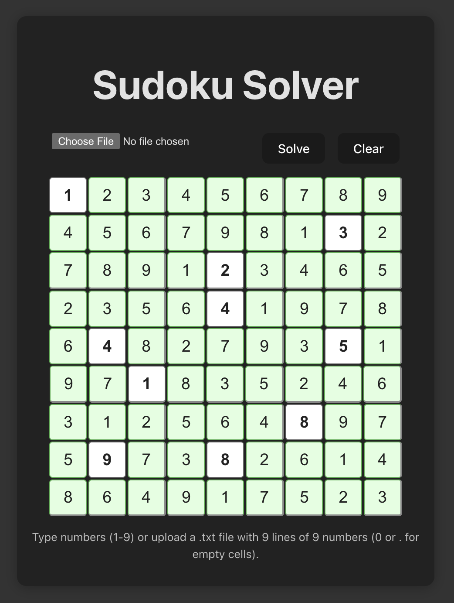

# Sudoku Solver Web Application

A modern web application that solves Sudoku puzzles using a backtracking algorithm. Built with React and Vite, this application provides an interactive interface for solving Sudoku puzzles with real-time validation and animated solutions.

## Features

- 🎮 Interactive 9x9 Sudoku grid
- ✨ Animated solution display
- 📤 Upload puzzles via text file
- 🎯 Real-time input validation
- 🎨 Modern, responsive UI
- ⚡ Fast solving algorithm
- 🚫 Error handling for unsolvable puzzles

## Tech Stack

- **Frontend Framework:** React 19
- **Build Tool:** Vite 6
- **Language:** JavaScript
- **Styling:** CSS3

## Getting Started

### Prerequisites

- Node.js (v14 or higher)
- npm or yarn

### Installation

1. Clone the repository:
```bash
git clone https://github.com/yourusername/sudoku-web-app.git
cd sudoku-web-app
```

2. Install dependencies:
```bash
npm install
# or
yarn install
```

3. Start the development server:
```bash
npm run dev
# or
yarn dev
```

4. Open your browser and navigate to `http://localhost:5173`

## Usage

### Manual Input
1. Click on any cell in the grid
2. Enter a number from 1-9
3. Click "Solve" to find the solution

### File Upload
1. Prepare a text file with 9 lines
2. Each line should contain 9 numbers (0 or . for empty cells)
3. Click "Choose File" and select your text file
4. Click "Solve" to find the solution

### Example Input File Format

530070000
600195000
098000060
800060003
400803001
700020006
060000280
000419005
000080079

## 📸 Screenshots

### Sudoku Board UI


### Game in Action


<h3>Sudoku Board UI</h3>


<h3>Game in Action</h3>


